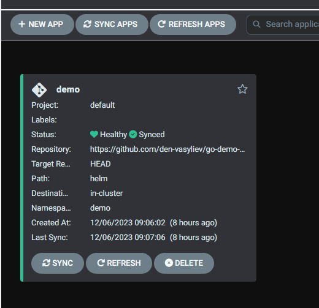

Create a new application in ArgoCD



Add port forwarding
```bash
kubectl port-forward -n demo svc/ambassador 8088:80
```
Download random png file
```bash
wget -O /tmp/g.png https://www.google.com/images/branding/googlelogo/1x/googlelogo_color_272x92dp.png
```
Upload this file to the converter
```bash
curl -F 'image=@/tmp/g.png' localhost:8088/img/
```

You should observe something like this

