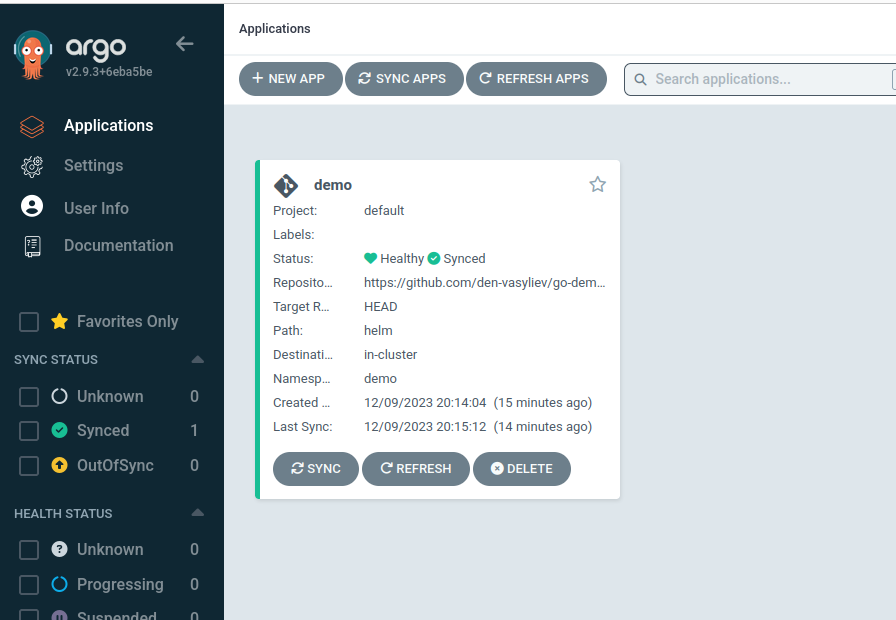
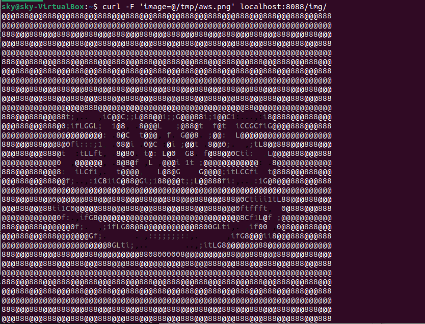

Create a new application in ArgoCD



Add port forwarding
```bash
kubectl port-forward -n demo svc/ambassador 8088:80
```
Download random png file
```bash
wget -O /tmp/aws.png https://w7.pngwing.com/pngs/544/61/png-transparent-aws-amazon-web-services-brands-and-logos-icon-thumbnail.png
```
Upload this file to the converter
```bash
curl -F 'image=@/tmp/aws.png' localhost:8088/img/
```

You should observe the following

